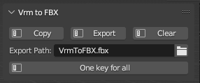

# Blender Addon - VrmToFBXWithTexture
This Addon can convert Vrm model to FBX with texture, need use VRM-Addon-for-Blender(https://github.com/saturday06/VRM-Addon-for-Blender) addon to import vrm model.

## How to Install

Download the python file VrmToFBXWithTexture.py and install via Blenders Addon-Preferences

Edit > Preferences > Add-ons > Install... > Select VrmToFBXWithTexture.py

## How to Use

This Addon adds 3 new operators which can be found in the 3DViews Object Menu:

* **Copy**
  * Copy imported vrm model, add to new collection VrmToFBX_Collection, and create new material set for export FBX file. This operation will copy and unpack textures in blender project file to it's location, this won't affect origin texture for the unpacked files are just copies.
* **Export**
  * Show export FBX window and auto set for export (enable "embed textures" option, and set "path_mode" to "COPY")
* **Clear**
  * Clear all res copied from first step, will not affect origin file.
* **One key for all**
  * Do "Copy" -> "Export" -> "Clear" by one click, FBX export path can be set in "Export path:" above.

